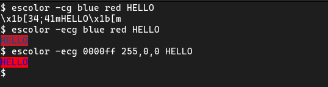
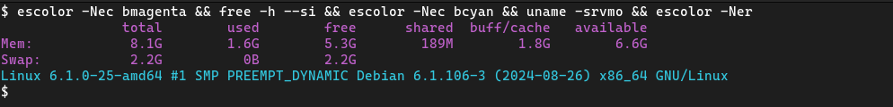

# escolor

**Escape Color!**

A command line tool that prints a string containing the escape sequence that produces ANSI effects and colors.
It can also print the escaped string.

It is posible to escape a sequence, then print something else with other tool and the escaped effects will
be aply to the output of that other tool, unless that tool manage its own effects.

## Why?

I made `escolor` to make it easier to obtain ANSI color escape sequences. I don't intend `escolor` to be a morer
complex tool than that.

It is also an experiment in how to get a command line tool to capture options in the typical Linux tool style.
It may not be the most efficient approach, but it is one that fits in a few lines of code in a single script.
For that reason I don't use `argparse`, `getopt` or the more limited `getopts`. This allowed me to interpret the
order of the arguments to make sequential changes to the output, where a normal argument is affected only by the
previous options and not the following ones.

## Bash version vs Python version

This repository provides a Bash version and a Python version. Both work exactly the same for all examples in
the help message.

A string with consecutive backslashes will have different results depending on the version you choose, but any
string can be printed with both by adding more or fewer backslashes.

## License

escolor is free software: you can redistribute it and/or modify it under the terms of the GNU General Public License as published by the Free Software Foundation, either version 3 of the License, or (at your option) any later version.

escolor is distributed in the hope that it will be useful, but WITHOUT ANY WARRANTY; without even the implied warranty of MERCHANTABILITY or FITNESS FOR A PARTICULAR PURPOSE. See the GNU General Public License for more details.
 
You should have received a copy of the GNU General Public License along with this program. If not, see <https://www.gnu.org/licenses/>.
